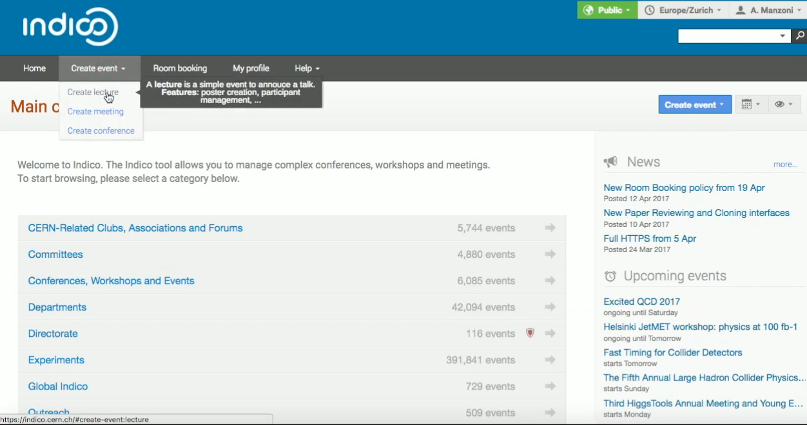

<!--
N.B.: Aquest README ha estat generat automàticament per <https://github.com/YunoHost/apps/tree/master/tools/readme_generator>
NO s'ha de modificar manualment.
-->

# Indico per YunoHost

[](https://ci-apps.yunohost.org/ci/apps/indico/)


[](https://install-app.yunohost.org/?app=indico)

*[Llegeix aquest README en altres idiomes.](./ALL_README.md)*

> *Aquest paquet et permet instal·lar Indico de forma ràpida i senzilla en un servidor YunoHost.*  
> *Si no tens YunoHost, consulta [la guia](https://yunohost.org/install) per saber com instal·lar-lo.*

## Visió general

# Indico 


**Indico** is:
 * 🗓 a general-purpose **event management** tool;
 * 🌍 fully **web-based**;
 * 🧩 **feature-rich** but also **extensible** through the use of [plugins](https://docs.getindico.io/en/stable/plugins/);
 * ⚖️ **Open-Source** Software under the MIT License;
 *  **made at CERN**, [the place where the web was born](https://home.cern/science/computing/birth-web)!

## What does it do?
Indico's **main features** are:
 * a powerful and flexible **hierarchical content management** system for events;
 * a full-blown **conference organization workflow** with:
   - 📢 **Call for Abstracts** and **abstract reviewing** modules;
   - 📝 flexible **registration form** creation and configuration;
   - 💰 integration with existing **payment systems**;
   - ✅ a **paper reviewing** workflow;
   - 🗓 a **drag and drop timetable management interface**;
   - 🎫 a simple **badge editor** with the possibility to print badges and tickets for participants;
 * tools for **meeting management** and archival of presentation materials;
 * a powerful **room booking** interface;
 * integration with existing **video conferencing solutions**;

A more detailed list [can be found here](https://getindico.io/features/). There is also a [video](https://www.youtube.com/watch?v=yo8rgg9dOcc)!


**Versió inclosa:** 3.3.6~ynh1

**Demo:** <https://sandbox.getindico.io/>

## Captures de pantalla



## Documentació i recursos

- Lloc web oficial de l'aplicació: <https://getindico.io/>
- Documentació oficial per l'usuari: <https://learn.getindico.io/>
- Documentació oficial per l'administrador: <https://docs.getindico.io/en>
- Repositori oficial del codi de l'aplicació: <https://github.com/indico/indico>
- Botiga YunoHost: <https://apps.yunohost.org/app/indico>
- Reportar un error: <https://github.com/YunoHost-Apps/indico_ynh/issues>

## Informació per a desenvolupadors

Envieu les pull request a la [branca `testing`](https://github.com/YunoHost-Apps/indico_ynh/tree/testing).

Per provar la branca `testing`, procedir com descrit a continuació:

```bash
sudo yunohost app install https://github.com/YunoHost-Apps/indico_ynh/tree/testing --debug
o
sudo yunohost app upgrade indico -u https://github.com/YunoHost-Apps/indico_ynh/tree/testing --debug
```

**Més informació sobre l'empaquetatge d'aplicacions:** <https://yunohost.org/packaging_apps>
